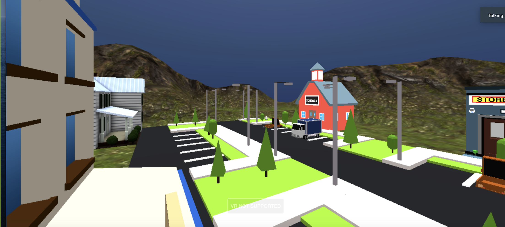
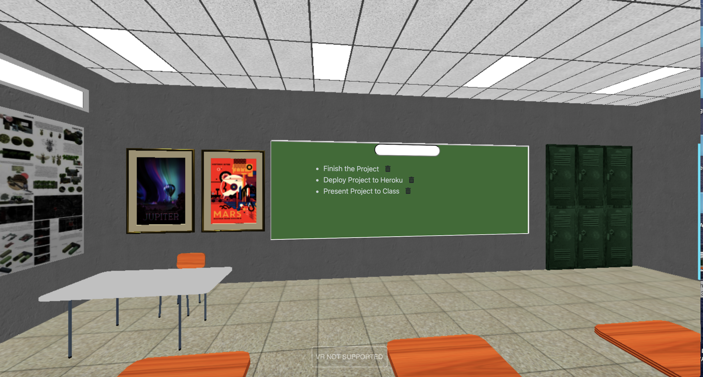

## Title 
Reality Tasks

​
# Table of Contents
  - [Concept](#Concept)
  - [Main APIs](#Main-APIs)
  - [User Stories](#User-Stories)
  - [Acceptance Criteria](#Acceptance-Criteria)
  - [Contribution](#Contribution)
  - [Links](#Links)
  - [Contact](#Contact)

## Concept 
A 3D immersive experience that allows the user to create a task list or to carry out the tasks virtually. A member-based website, where the user can log into your account to be placed into a virtual environment. The user can choose a building that aligns with the tasks they need to do. Once inside the building the user is presented with a task list they can add, edit, and delete tasks that correspond to the chosen building. We want to create a fun alternative to task management. 
​
## Main APIs
threeJS
WebVR.js
Passport
Express
Sequelize
​
​
## User Stories
AS a USER, 
I want an interactive task list experience,
SO THAT,
I can keep track of my daily activities in a fun way.

## Acceptance Criteria 
WHEN I visit the website/app,
I am asked to sign up/log in to my task list account,
THEN I am placed in a virtual environment where I can choose a building to enter,
WHERE I am presented with a task list corresponding to that location.

## Contributors
Jacob Lovins, Natalie Garcia, David Bolding

## Links
Link to Github Repor: https://github.com/nataliegarcia-8/reality-tasks

Link to Deployed Site: https://rocky-reaches-21290.herokuapp.com/

## Contact
Jacob Lovins: [https://github.com/jacoblovins/](https://github.com/jacoblovins/)
Natalie Garcia: [https://github.com/nataliegarcia-8](https://github.com/nataliegarcia-8)
David Bolding:[https://github.com/dbolding12](https://github.com/dbolding12/)

  

